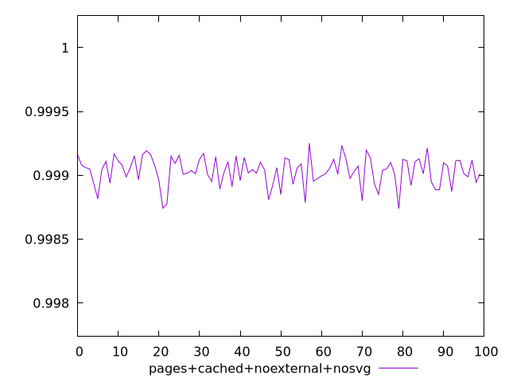
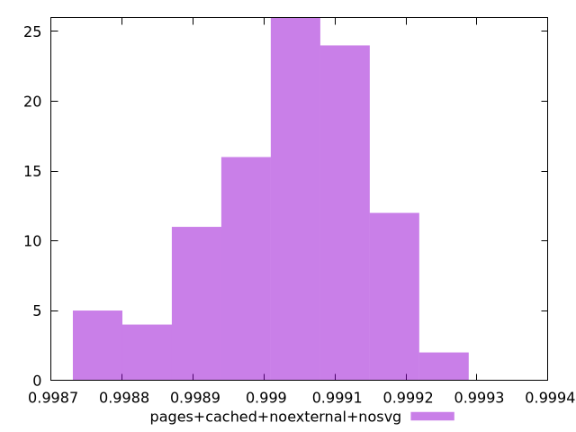
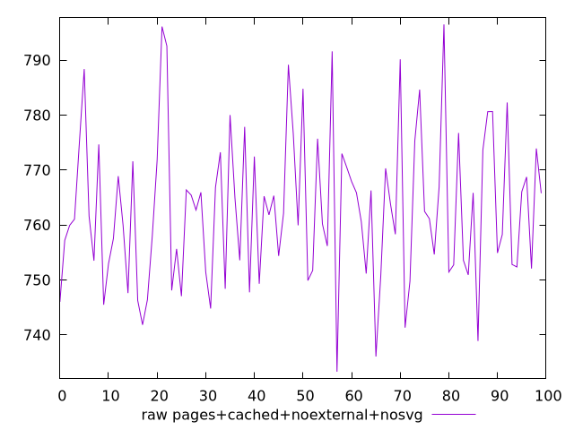
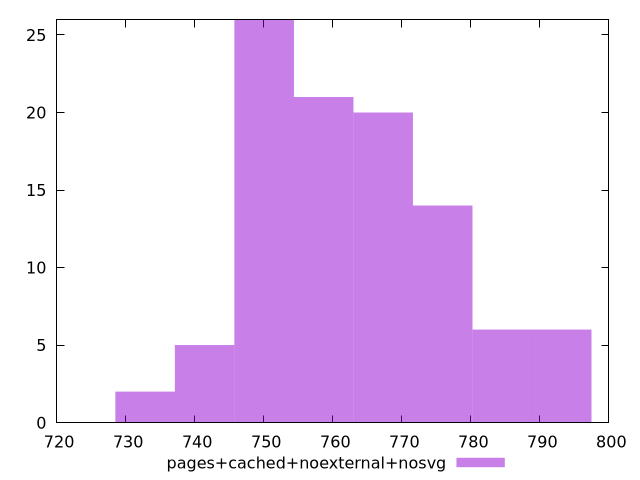

# Report pages+cached+noexternal+nosvg

[parent..](./..)  


## Scores

  

## Score Histogram

  

## Score Indicators

```yaml
min: 0.9987388985739758
max: 0.999251899990776
range: 0.0005130014168002184
mean: 0.9990325405487966
median: 0.9990461603511146
stdev: 0.00011169458563204381
skewness: -0.6005999362753247

```

## Raw Values

  

## Raw Values Histogram

  

## Raw Indicators

```yaml
min: 733.2840000000002
max: 796.4920000000003
range: 63.208000000000084
mean: 762.8223200000003
median: 761.7080000000005
stdev: 13.713744768574292
skewness: 0.39945867783253325

```

<style>
  img {
    max-width: 80%;
  }
</style>
      
