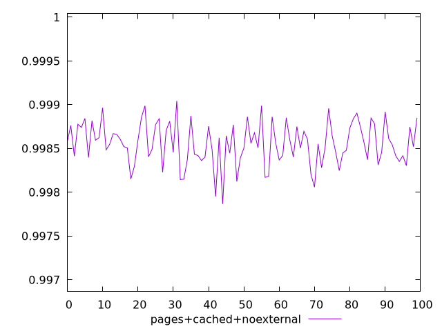
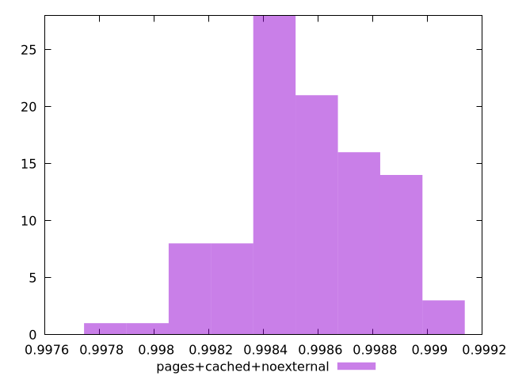
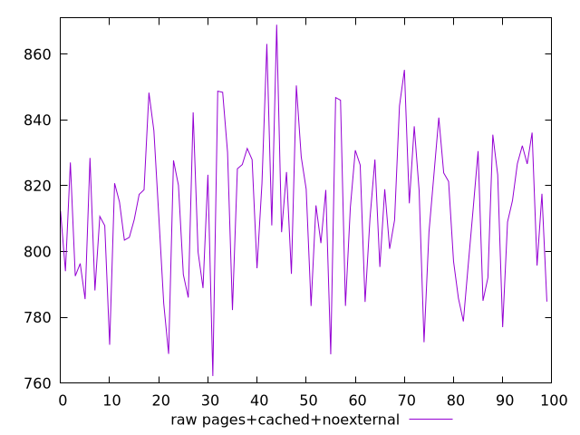
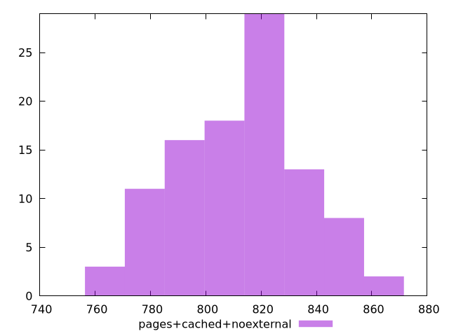

# Report pages+cached+noexternal

[parent..](./..)  


## Scores

  

## Score Histogram

  

## Score Indicators

```yaml
min: 0.9978667139511739
max: 0.9990427653865365
range: 0.0011760514353625906
mean: 0.9985551421441734
median: 0.9985496103993392
stdev: 0.00024374099813715262
skewness: -0.2798721282267271

```

## Raw Values

  

## Raw Values Histogram

  

## Raw Indicators

```yaml
min: 762.1359999999999
max: 868.9280000000007
range: 106.79200000000083
mean: 812.8960400000002
median: 814.8300000000002
stdev: 22.528541751263027
skewness: -0.01619910108076513

```

<style>
  img {
    max-width: 80%;
  }
</style>
      
