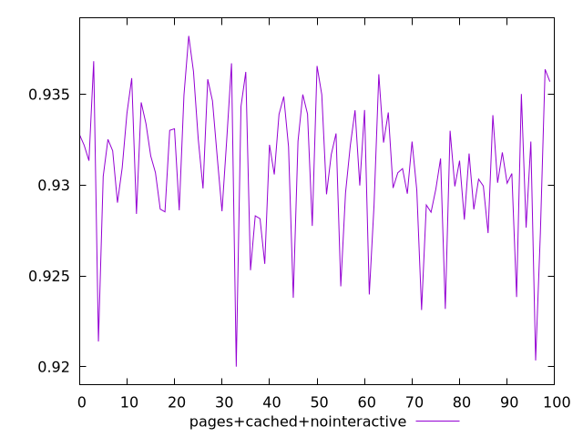
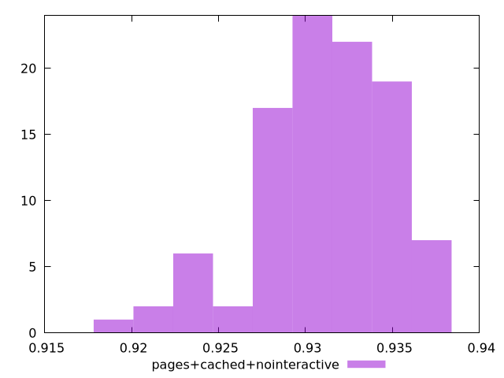
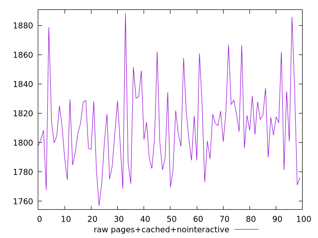
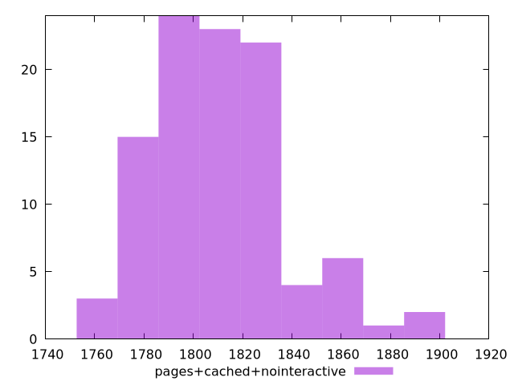

# Report pages+cached+nointeractive

[parent..](./..)  


## Scores

  

## Score Histogram

  

## Score Indicators

```yaml
min: 0.9200074921196413
max: 0.938207777902113
range: 0.01820028578247168
mean: 0.9309454064981506
median: 0.9314019204075087
stdev: 0.003747667949996482
skewness: -0.7055878580102017

```

## Raw Values

  

## Raw Values Histogram

  

## Raw Indicators

```yaml
min: 1756.96
max: 1888.1400000000006
range: 131.18000000000052
mean: 1810.9602800000011
median: 1807.9880000000012
stdev: 27.080958046597885
skewness: 0.6296756550401369

```

<style>
  img {
    max-width: 80%;
  }
</style>
      
