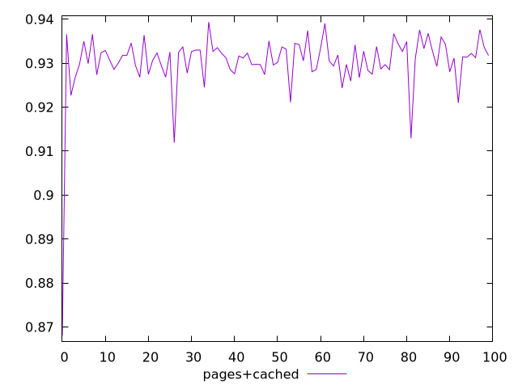
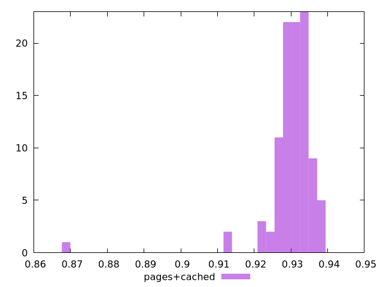
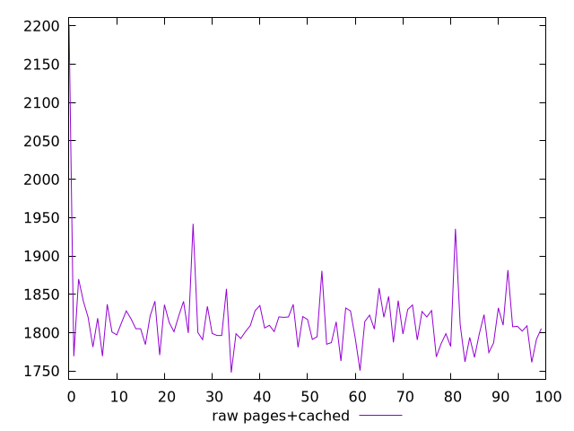
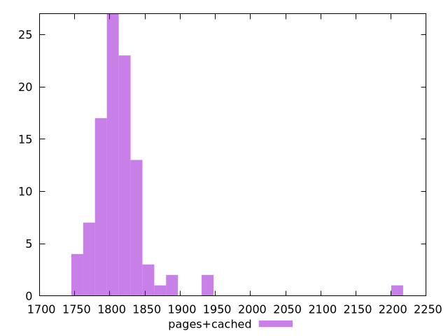

# Report pages+cached

[parent..](./..)  


## Scores

  

## Score Histogram

  

## Score Indicators

```yaml
min: 0.8680866334322944
max: 0.939377046757107
range: 0.07129041332481256
mean: 0.930270351829451
median: 0.9313301973097673
stdev: 0.007652425963607913
skewness: -5.565555936056606

```

## Raw Values

  

## Raw Values Histogram

  

## Raw Indicators

```yaml
min: 1747.9120000000012
max: 2201.887999999988
range: 453.9759999999869
mean: 1815.0792799999992
median: 1808.5120000000009
stdev: 50.06839846251821
skewness: 4.8379542817820615

```

<style>
  img {
    max-width: 80%;
  }
</style>
      
