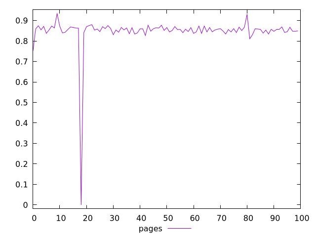
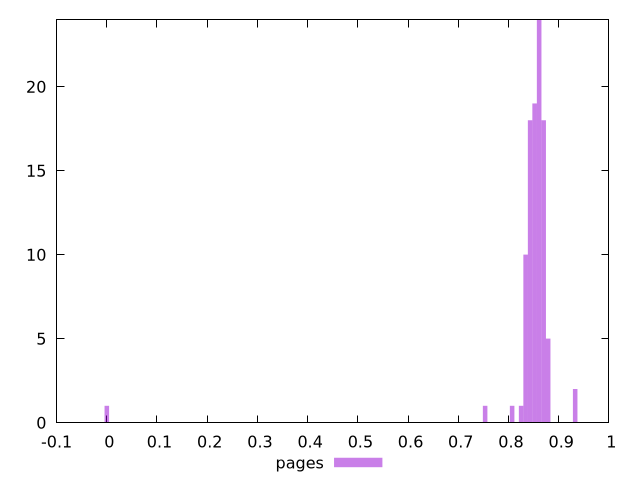
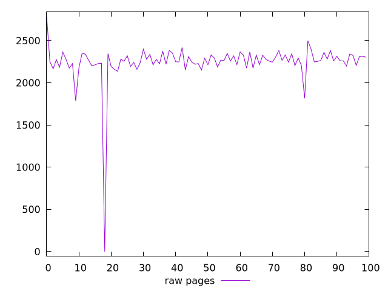
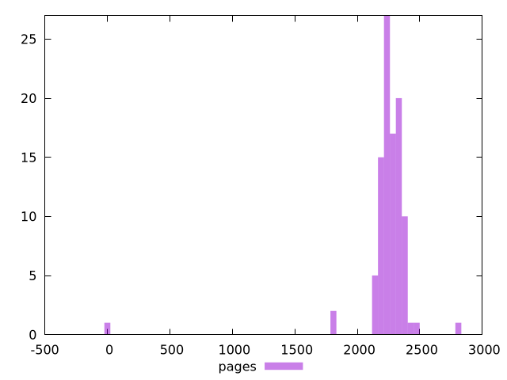

# Report pages

[parent..](./..)  


## Scores

  

## Score Histogram

  

## Score Indicators

```yaml
min: 0
max: 0.9344992636423556
range: 0.9344992636423556
mean: 0.8468415841572291
median: 0.8565459284007806
stdev: 0.08741011795666534
skewness: -9.082345801263918

```

## Raw Values

  

## Raw Values Histogram

  

## Raw Indicators

```yaml
min: 0
max: 2785.4399999999846
range: 2785.4399999999846
mean: 2245.2890399999806
median: 2262.231999999981
stdev: 250.48002707480848
skewness: -7.181449522645449

```

<style>
  img {
    max-width: 80%;
  }
</style>
      
