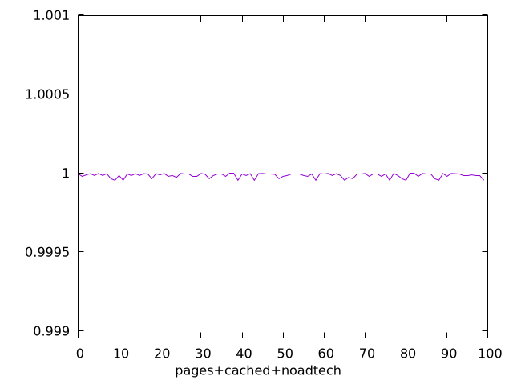
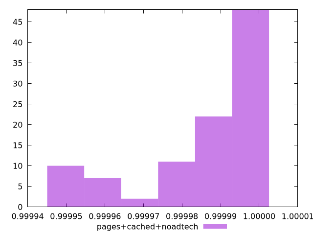
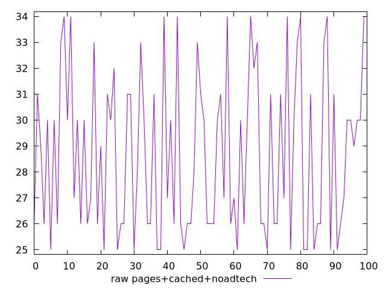
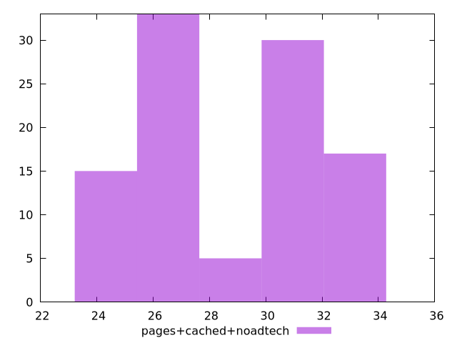

# Report pages+cached+noadtech

[parent..](./..)  


## Scores

  

## Score Histogram

  

## Score Indicators

```yaml
min: 0.9999538249219597
max: 0.9999967944940666
range: 0.000042969572106921206
mean: 0.9999844919723319
median: 0.9999894733587942
stdev: 0.000013848255941312964
skewness: -1.0881344152603467

```

## Raw Values

  

## Raw Values Histogram

  

## Raw Indicators

```yaml
min: 25
max: 34
range: 9
mean: 28.69
median: 28.5
stdev: 3.058414621989633
skewness: 0.3530089869631771

```

<style>
  img {
    max-width: 80%;
  }
</style>
      
