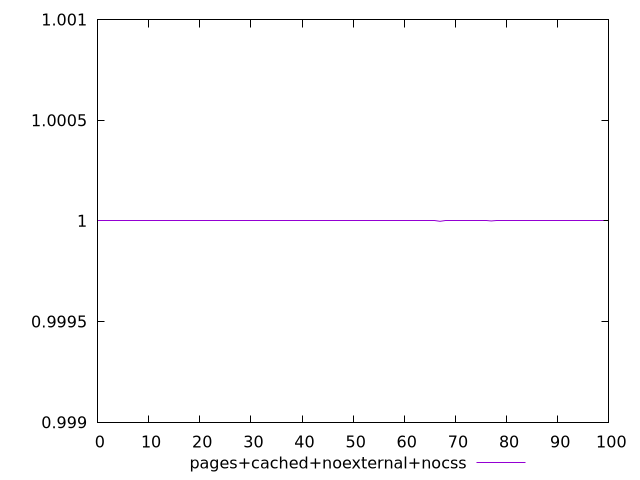
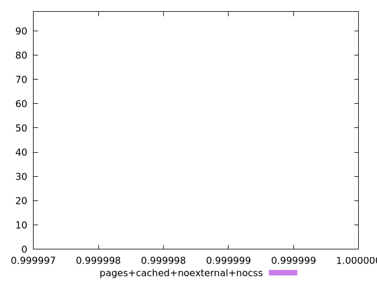
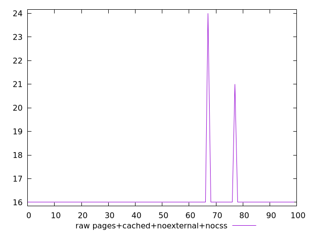
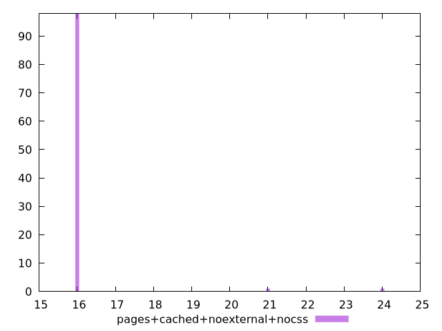

# Report pages+cached+noexternal+nocss

[parent..](./..)  


## Scores

  

## Score Histogram

  

## Score Indicators

```yaml
min: 0.99999780855098
max: 0.9999999641342965
range: 0.0000021555833165098903
mean: 0.999999936886785
median: 0.9999999641342965
stdev: 2.2127468240282035e-7
skewness: -9.043739927503248

```

## Raw Values

  

## Raw Values Histogram

  

## Raw Indicators

```yaml
min: 16
max: 24
range: 8
mean: 16.13
median: 16
stdev: 0.9343982020530673
skewness: 7.387991612482548

```

<style>
  img {
    max-width: 80%;
  }
</style>
      
