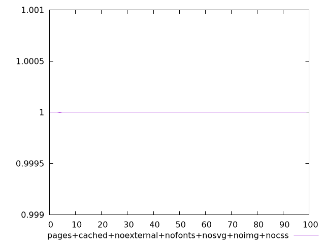
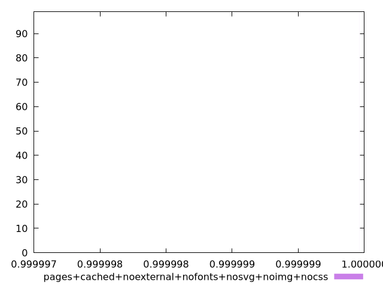
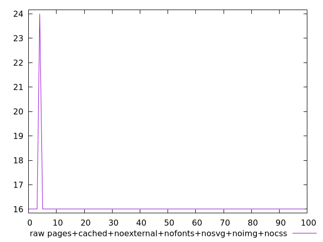
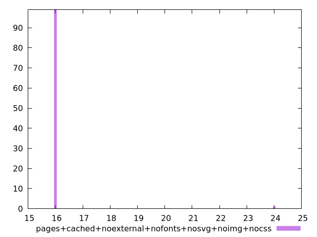

# Report pages+cached+noexternal+nofonts+nosvg+noimg+nocss

[parent..](./..)  


## Scores

  

## Score Histogram

  

## Score Indicators

```yaml
min: 0.99999780855098
max: 0.9999999641342965
range: 0.0000021555833165098903
mean: 0.9999999425784611
median: 0.9999999641342965
stdev: 2.1447783195639638e-7
skewness: -9.849370559134092

```

## Raw Values

  

## Raw Values Histogram

  

## Raw Indicators

```yaml
min: 16
max: 24
range: 8
mean: 16.08
median: 16
stdev: 0.7959899496852959
skewness: 9.849370589540321

```

<style>
  img {
    max-width: 80%;
  }
</style>
      
