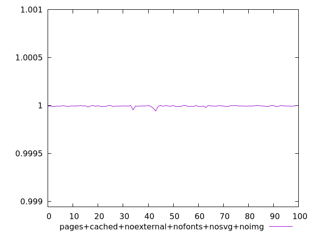
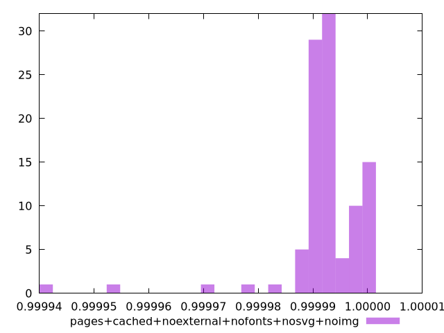
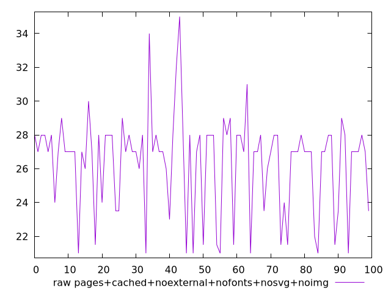

# Report pages+cached+noexternal+nofonts+nosvg+noimg

[parent..](./..)  


## Scores

  

## Score Histogram

  

## Score Indicators

```yaml
min: 0.9999416738899494
max: 0.9999993949667043
range: 0.00005772107675494631
mean: 0.9999925717634843
median: 0.9999935431491718
stdev: 0.000007766687596591435
skewness: -4.190785050774698

```

## Raw Values

  

## Raw Values Histogram

  

## Raw Indicators

```yaml
min: 21
max: 35
range: 14
mean: 26.4
median: 27
stdev: 2.8442925306655793
skewness: -0.331677170063601

```

<style>
  img {
    max-width: 80%;
  }
</style>
      
