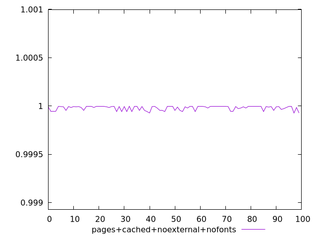
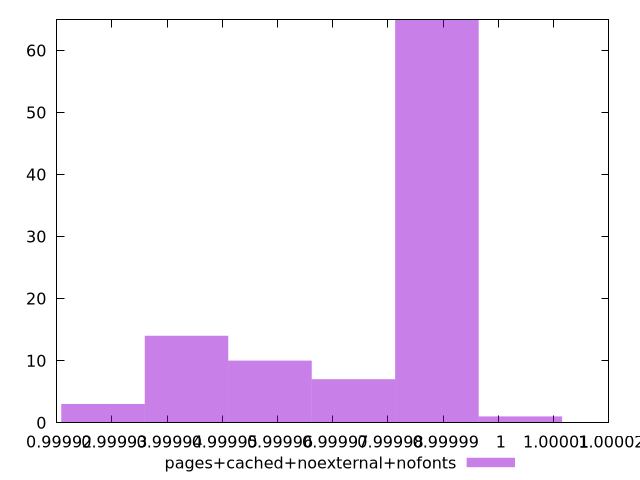
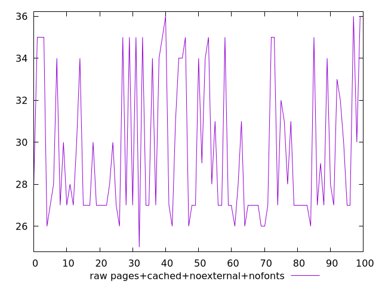
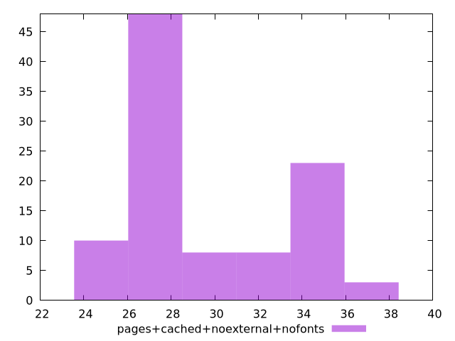

# Report pages+cached+noexternal+nofonts

[parent..](./..)  


## Scores

  

## Score Histogram

  

## Score Indicators

```yaml
min: 0.9999270232664161
max: 0.9999967944940666
range: 0.00006977122765050581
mean: 0.9999785321668041
median: 0.9999923108256459
stdev: 0.000021513345581482087
skewness: -1.0521315530619622

```

## Raw Values

  

## Raw Values Histogram

  

## Raw Indicators

```yaml
min: 25
max: 36
range: 11
mean: 29.57
median: 27.5
stdev: 3.418347554009102
skewness: 0.673529587175602

```

<style>
  img {
    max-width: 80%;
  }
</style>
      
