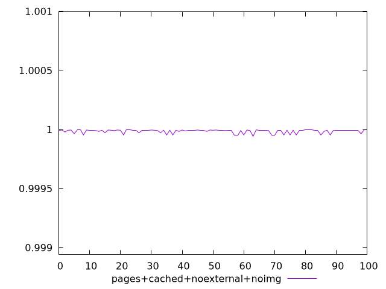
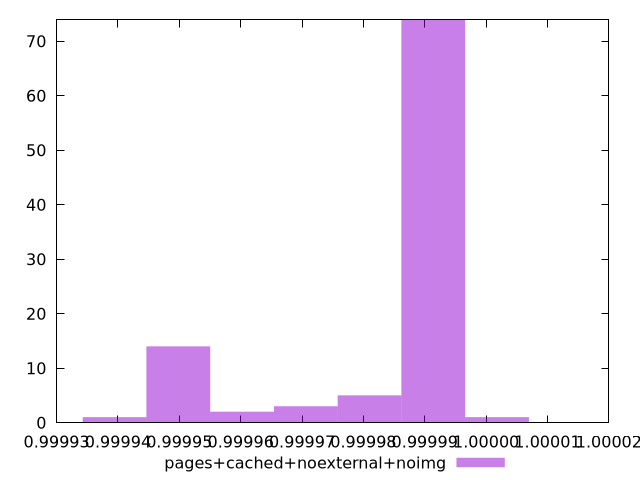
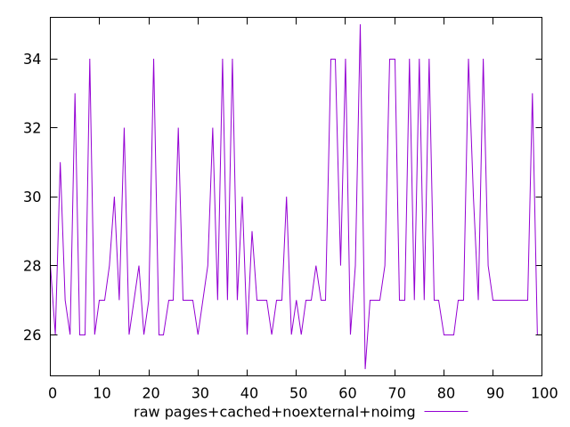
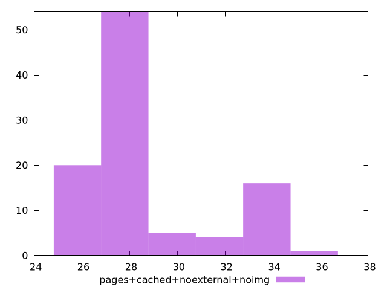

# Report pages+cached+noexternal+noimg

[parent..](./..)  


## Scores

  

## Score Histogram

  

## Score Indicators

```yaml
min: 0.9999416738899494
max: 0.9999967944940666
range: 0.00005512060411727582
mean: 0.9999857874254597
median: 0.9999935431491718
stdev: 0.00001506669284166229
skewness: -1.5554120310759834

```

## Raw Values

  

## Raw Values Histogram

  

## Raw Indicators

```yaml
min: 25
max: 35
range: 10
mean: 28.39
median: 27
stdev: 2.8138763299050646
skewness: 1.2175380825804178

```

<style>
  img {
    max-width: 80%;
  }
</style>
      
