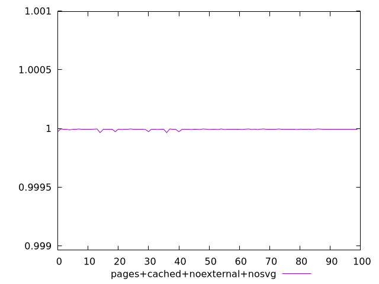
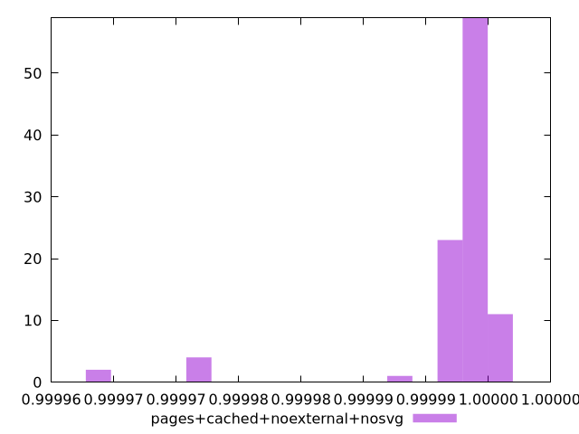
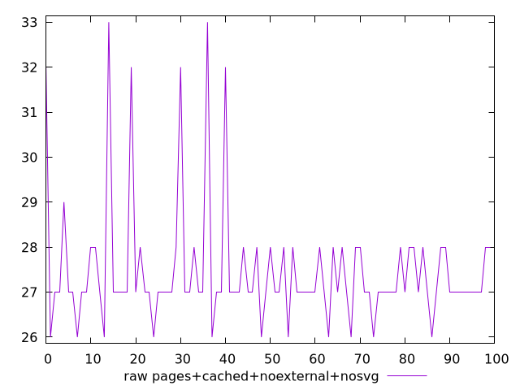
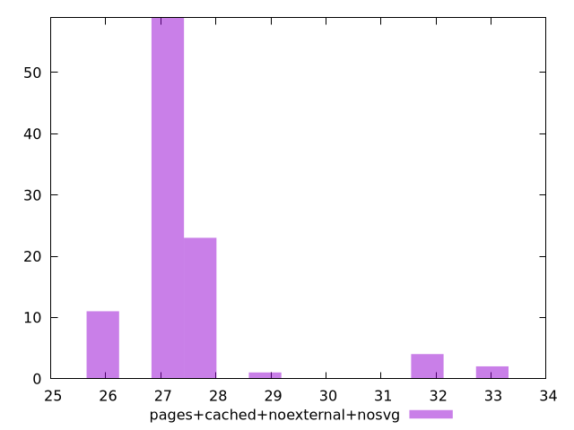

# Report pages+cached+noexternal+nosvg

[parent..](./..)  


## Scores

  

## Score Histogram

  

## Score Indicators

```yaml
min: 0.9999638148729413
max: 0.9999954072993993
range: 0.00003159242645800475
mean: 0.9999916663473211
median: 0.9999935431491718
stdev: 0.000005907859916713589
skewness: -3.5380192536428177

```

## Raw Values

  

## Raw Values Histogram

  

## Raw Indicators

```yaml
min: 26
max: 33
range: 7
mean: 27.46
median: 27
stdev: 1.374190670904151
skewness: 2.626826626290748

```

<style>
  img {
    max-width: 80%;
  }
</style>
      
