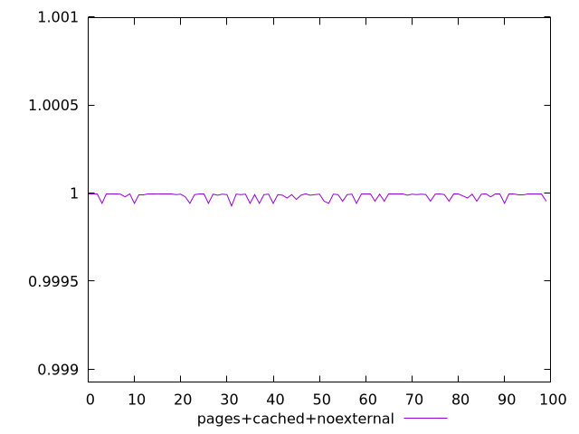
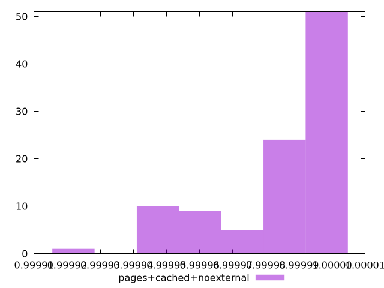
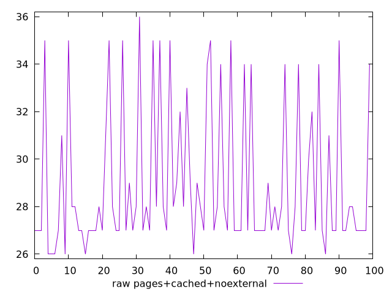
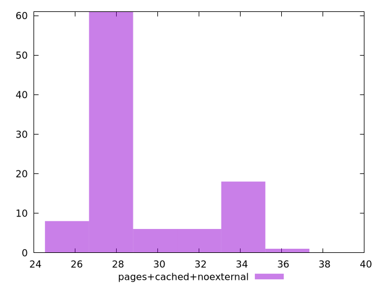

# Report pages+cached+noexternal

[parent..](./..)  


## Scores

  

## Score Histogram

  

## Score Indicators

```yaml
min: 0.9999270232664161
max: 0.9999954072993993
range: 0.00006838403298314866
mean: 0.9999826572519419
median: 0.9999935431491718
stdev: 0.000018704906292649593
skewness: -1.494664010253943

```

## Raw Values

  

## Raw Values Histogram

  

## Raw Indicators

```yaml
min: 26
max: 36
range: 10
mean: 28.96
median: 27
stdev: 3.0295874306578443
skewness: 1.1429402768480517

```

<style>
  img {
    max-width: 80%;
  }
</style>
      
