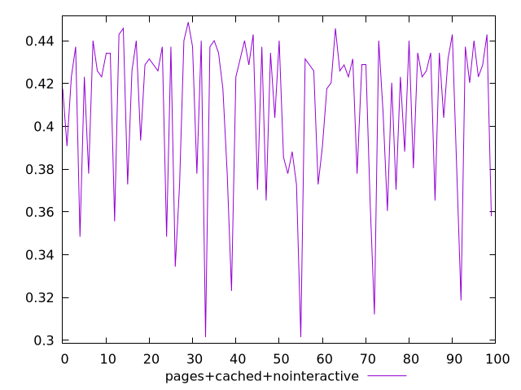
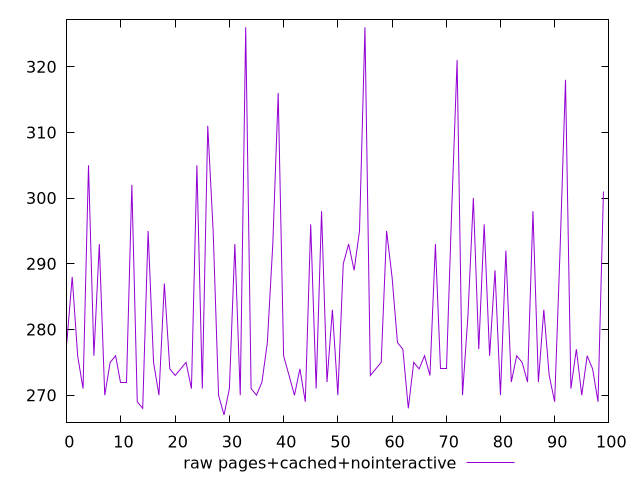
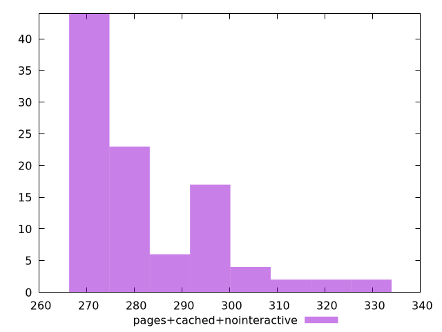

# Report pages+cached+nointeractive

[parent..](./..)  


## Scores

  

## Score Histogram

  

## Score Indicators

```yaml
min: 0.30146316384229
max: 0.4487066999006886
range: 0.14724353605839863
mean: 0.4084690564625155
median: 0.4245203983866053
stdev: 0.03601967105821351
skewness: -1.1891408393246934

```

## Raw Values

  

## Raw Values Histogram

  

## Raw Indicators

```yaml
min: 267
max: 326
range: 59
mean: 281.85
median: 275.5
stdev: 14.010977838823393
skewness: 1.3362461941324013

```

<style>
  img {
    max-width: 80%;
  }
</style>
      
