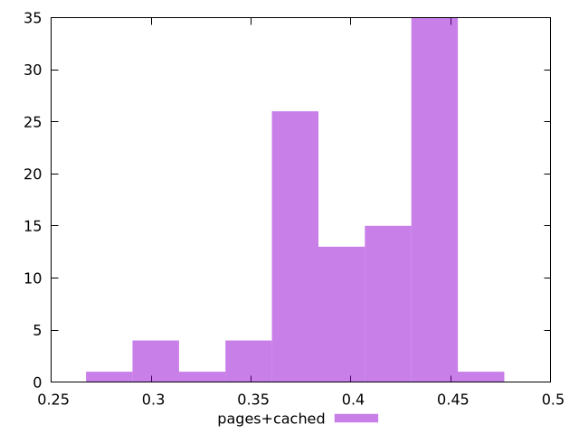

# Report pages+cached

[parent..](./..)  


## Scores

  

## Score Histogram

  

## Score Indicators

```yaml
min: 0.27338664435277554
max: 0.4545418770856656
range: 0.18115523273289008
mean: 0.402249988398065
median: 0.41485657114368835
stdev: 0.03838066991399968
skewness: -0.9770217032759896

```

## Raw Values

  

## Raw Values Histogram

  

## Raw Indicators

```yaml
min: 265
max: 340
range: 75
mean: 284.25000000000006
median: 279
stdev: 15.101903853488189
skewness: 1.2305725472253468

```

<style>
  img {
    max-width: 80%;
  }
</style>
      
