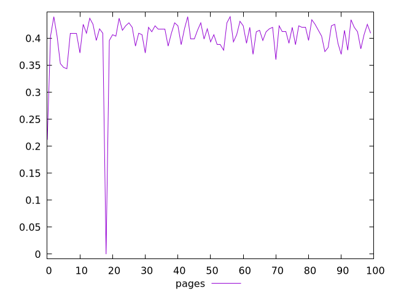
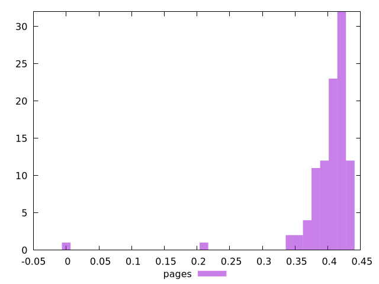
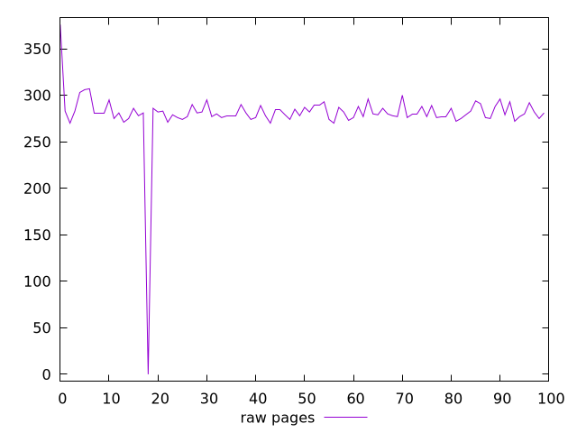
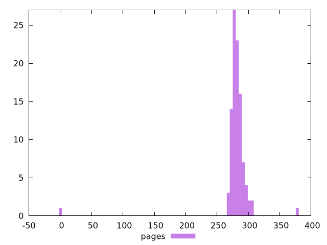

# Report pages

[parent..](./..)  


## Scores

  

## Score Histogram

  

## Score Indicators

```yaml
min: 0
max: 0.44005621242607357
range: 0.44005621242607357
mean: 0.4011784576928533
median: 0.41075973182857556
stdev: 0.04917035300762584
skewness: -6.001898025422848

```

## Raw Values

  

## Raw Values Histogram

  

## Raw Indicators

```yaml
min: 0
max: 376
range: 376
mean: 280.09
median: 280.0000000000009
stdev: 30.64835884676372
skewness: -7.2978582757061785

```

<style>
  img {
    max-width: 80%;
  }
</style>
      
