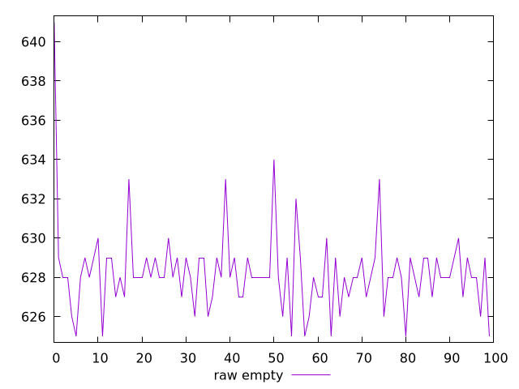
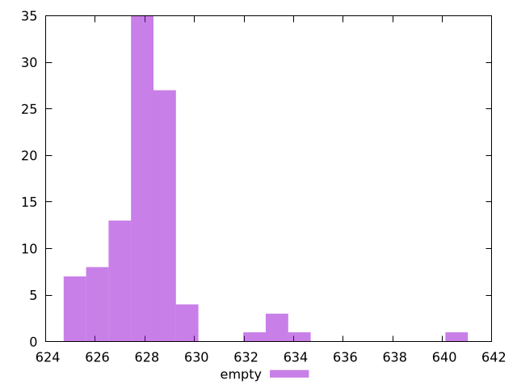

# Report empty

[parent..](./..)  


## Scores

  

## Score Histogram

  

## Score Indicators

```yaml
{}

```

## Raw Values

  

## Raw Values Histogram

  

## Raw Indicators

```yaml
min: 625
max: 641
range: 16
mean: 628.23
median: 628
stdev: 2.101689796330564
skewness: 2.5195617457168797

```

<style>
  img {
    max-width: 80%;
  }
</style>
      
