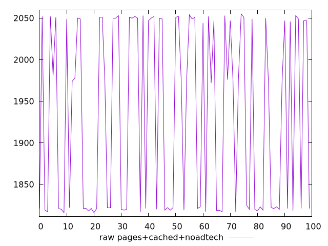
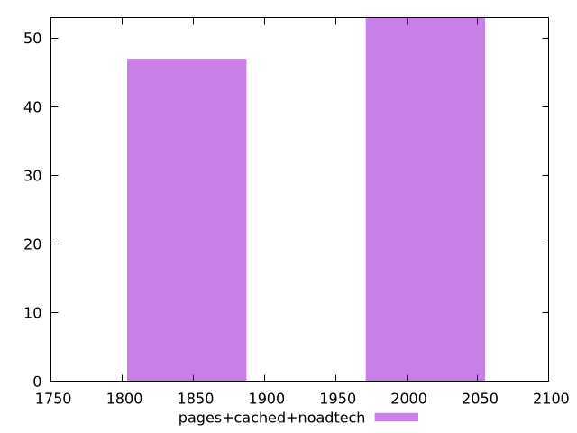

# Report pages+cached+noadtech

[parent..](./..)  


## Scores

  

## Score Histogram

  

## Score Indicators

```yaml
{}

```

## Raw Values

  

## Raw Values Histogram

  

## Raw Indicators

```yaml
min: 1816
max: 2055
range: 239
mean: 1933.02
median: 1973.5
stdev: 108.84089121281579
skewness: -0.007735149793696767

```

<style>
  img {
    max-width: 80%;
  }
</style>
      
