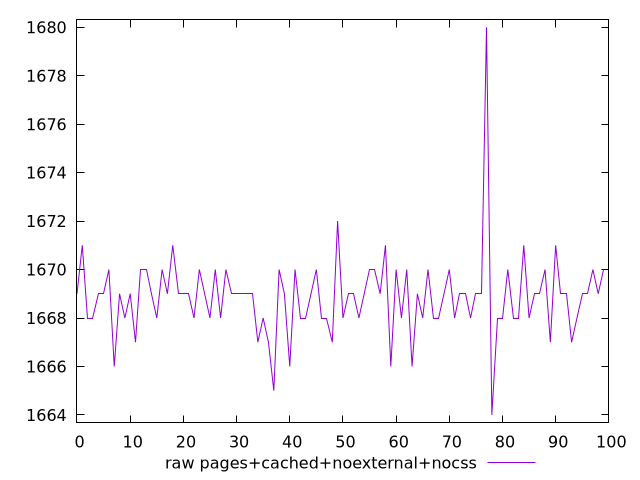
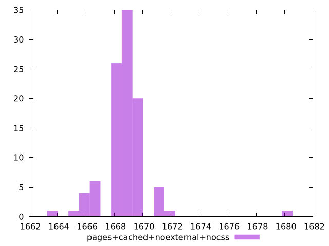

# Report pages+cached+noexternal+nocss

[parent..](./..)  


## Scores

  

## Score Histogram

  

## Score Indicators

```yaml
{}

```

## Raw Values

  

## Raw Values Histogram

  

## Raw Indicators

```yaml
min: 1664
max: 1680
range: 16
mean: 1668.85
median: 1669
stdev: 1.7168284713389415
skewness: 2.3318042278963538

```

<style>
  img {
    max-width: 80%;
  }
</style>
      
