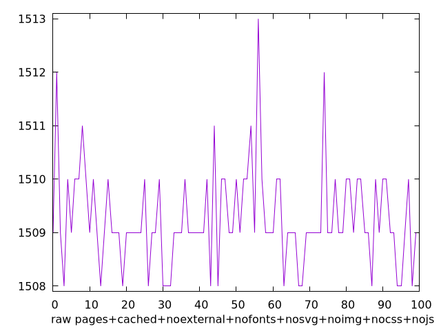
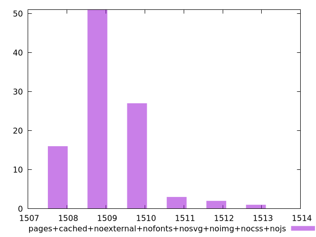

# Report pages+cached+noexternal+nofonts+nosvg+noimg+nocss+nojs

[parent..](./..)  


## Scores

  

## Score Histogram

  

## Score Indicators

```yaml
{}

```

## Raw Values

  

## Raw Values Histogram

  

## Raw Indicators

```yaml
min: 1508
max: 1513
range: 5
mean: 1509.27
median: 1509
stdev: 0.9039358384310249
skewness: 1.1487396938929009

```

<style>
  img {
    max-width: 80%;
  }
</style>
      
