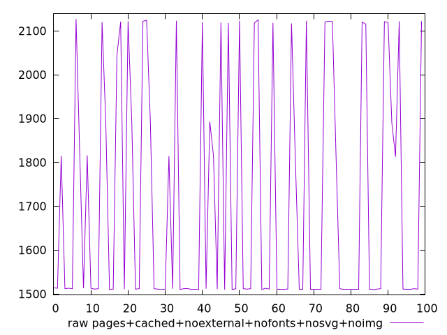
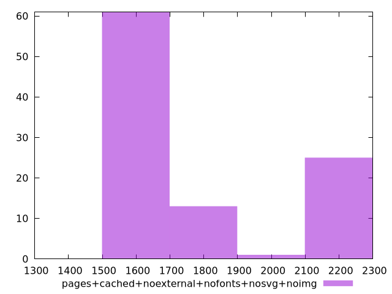

# Report pages+cached+noexternal+nofonts+nosvg+noimg

[parent..](./..)  


## Scores

  

## Score Histogram

  

## Score Indicators

```yaml
{}

```

## Raw Values

  

## Raw Values Histogram

  

## Raw Indicators

```yaml
min: 1510
max: 2127
range: 617
mean: 1712.23
median: 1512
stdev: 264.4722614944713
skewness: 0.6944962233424544

```

<style>
  img {
    max-width: 80%;
  }
</style>
      
