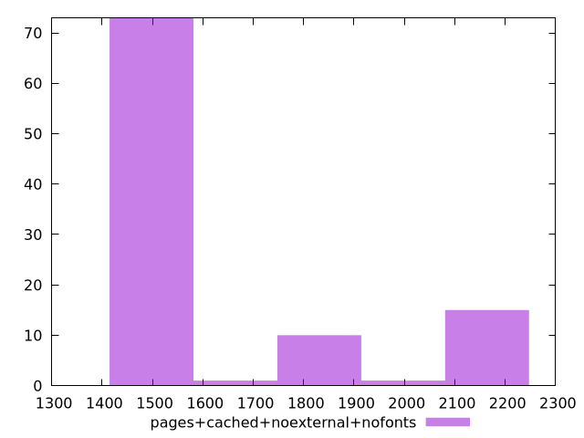

# Report pages+cached+noexternal+nofonts

[parent..](./..)  


## Scores

  

## Score Histogram

  

## Score Indicators

```yaml
{}

```

## Raw Values

  

## Raw Values Histogram

  

## Raw Indicators

```yaml
min: 1511
max: 2133
range: 622
mean: 1646.58
median: 1513
stdev: 232.54583118172633
skewness: 1.318236327580945

```

<style>
  img {
    max-width: 80%;
  }
</style>
      
