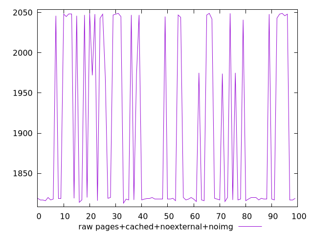
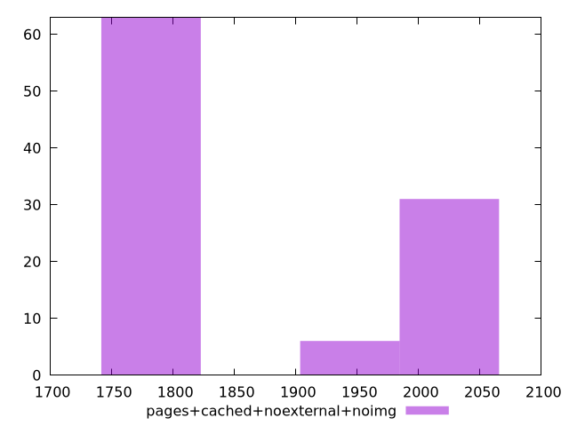

# Report pages+cached+noexternal+noimg

[parent..](./..)  


## Scores

  

## Score Histogram

  

## Score Indicators

```yaml
{}

```

## Raw Values

  

## Raw Values Histogram

  

## Raw Indicators

```yaml
min: 1813
max: 2049
range: 236
mean: 1898.08
median: 1819
stdev: 106.00308297403433
skewness: 0.6012109345568638

```

<style>
  img {
    max-width: 80%;
  }
</style>
      
