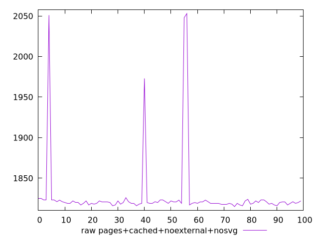
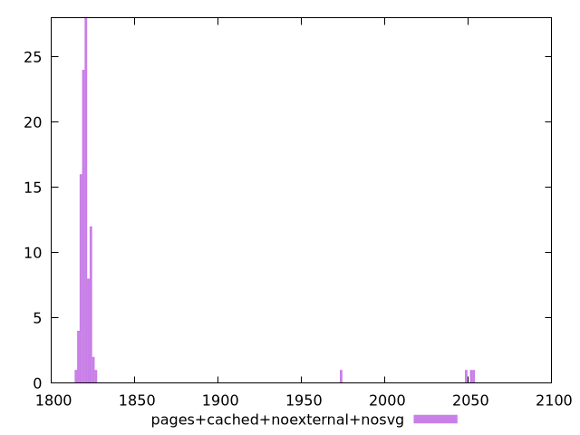

# Report pages+cached+noexternal+nosvg

[parent..](./..)  


## Scores

  

## Score Histogram

  

## Score Indicators

```yaml
{}

```

## Raw Values

  

## Raw Values Histogram

  

## Raw Indicators

```yaml
min: 1815
max: 2053
range: 238
mean: 1828.47
median: 1820
stdev: 41.991774194477664
skewness: 4.844191925648525

```

<style>
  img {
    max-width: 80%;
  }
</style>
      
