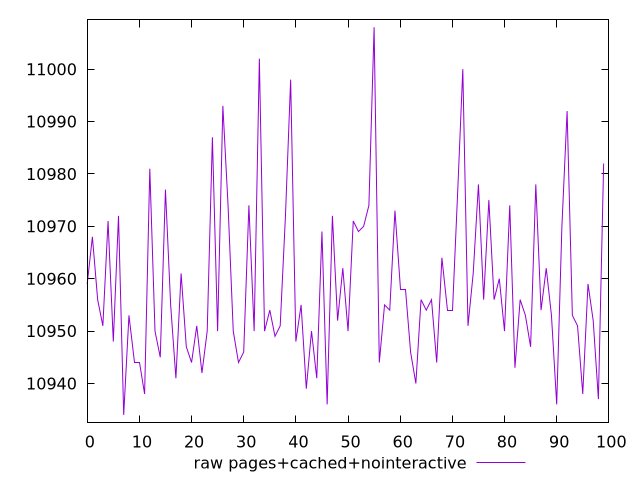
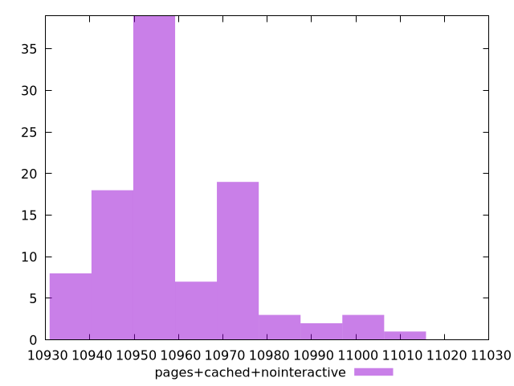

# Report pages+cached+nointeractive

[parent..](./..)  


## Scores

  

## Score Histogram

  

## Score Indicators

```yaml
{}

```

## Raw Values

  

## Raw Values Histogram

  

## Raw Indicators

```yaml
min: 10934
max: 11008
range: 74
mean: 10958.55
median: 10954
stdev: 15.682075755460426
skewness: 1.0063292083347455

```

<style>
  img {
    max-width: 80%;
  }
</style>
      
