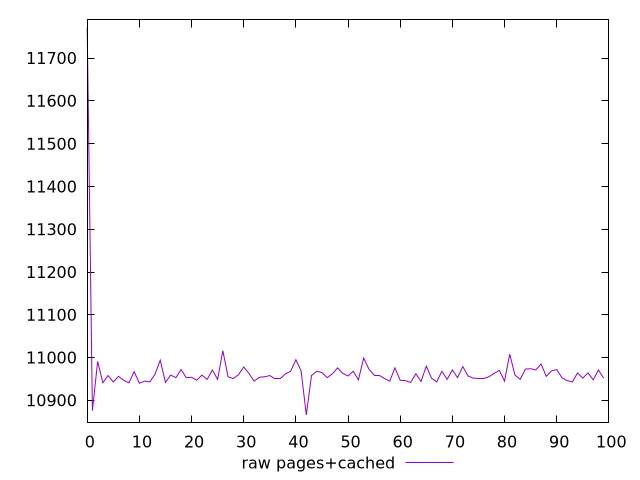
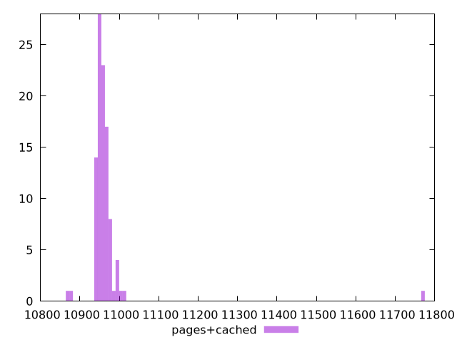

# Report pages+cached

[parent..](./..)  


## Scores

  

## Score Histogram

  

## Score Indicators

```yaml
{}

```

## Raw Values

  

## Raw Values Histogram

  

## Raw Indicators

```yaml
min: 10866
max: 11772
range: 906
mean: 10966.45
median: 10957
stdev: 83.2207155701031
skewness: 9.038748817962507

```

<style>
  img {
    max-width: 80%;
  }
</style>
      
