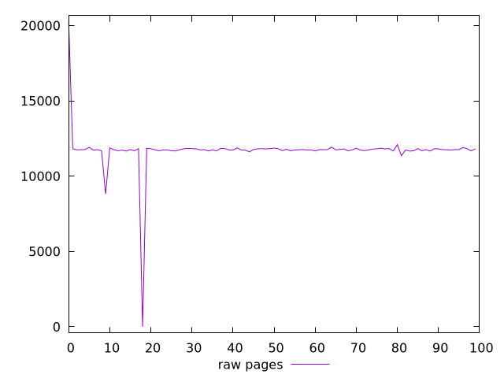
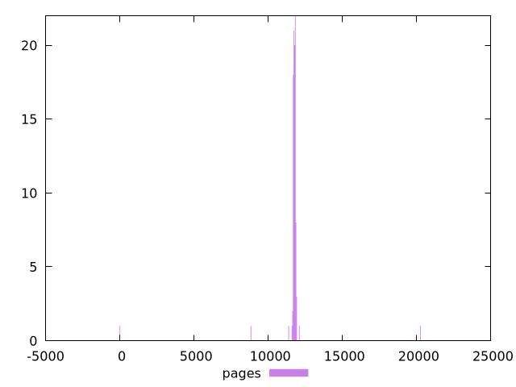

# Report pages

[parent..](./..)  


## Scores

  

## Score Histogram

  

## Score Indicators

```yaml
{}

```

## Raw Values

  

## Raw Values Histogram

  

## Raw Indicators

```yaml
min: 0
max: 20273
range: 20273
mean: 11702.58
median: 11759
stdev: 1482.5560777252238
skewness: -3.0600689689611316

```

<style>
  img {
    max-width: 80%;
  }
</style>
      
