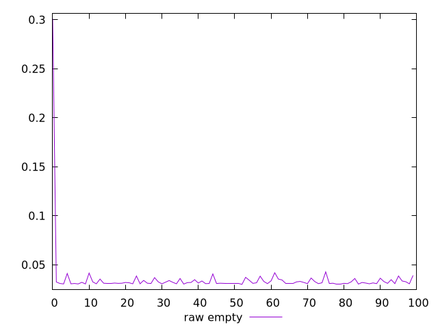
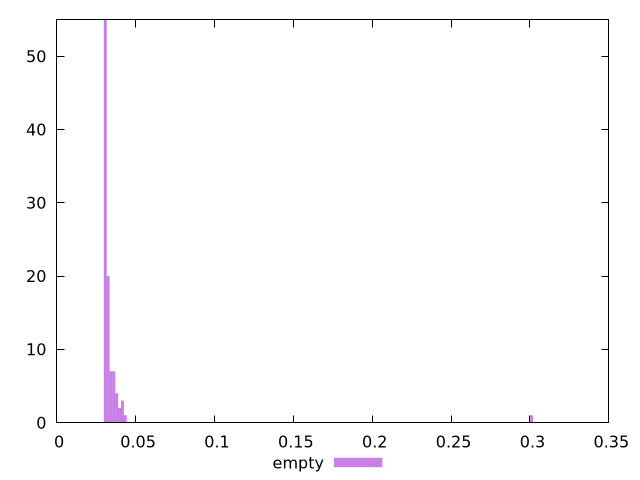

# Report empty

[parent..](./..)  


## Scores

  

## Score Histogram

  

## Score Indicators

```yaml
{}

```

## Raw Values

  

## Raw Values Histogram

  

## Raw Indicators

```yaml
min: 0.03
max: 0.30100000000000193
range: 0.2710000000000019
mean: 0.035407000000000036
median: 0.031349999999999996
stdev: 0.026852950508277677
skewness: 9.673233092709902

```

<style>
  img {
    max-width: 80%;
  }
</style>
      
