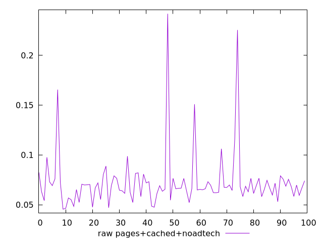
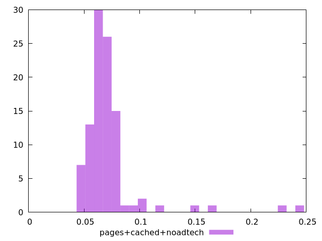

# Report pages+cached+noadtech

[parent..](./..)  


## Scores

  

## Score Histogram

  

## Score Indicators

```yaml
{}

```

## Raw Values

  

## Raw Values Histogram

  

## Raw Indicators

```yaml
min: 0.0455
max: 0.24180000000000001
range: 0.19630000000000003
mean: 0.0726668693113631
median: 0.06709999999999999
stdev: 0.02882162247543831
skewness: 4.027451531456794

```

<style>
  img {
    max-width: 80%;
  }
</style>
      
