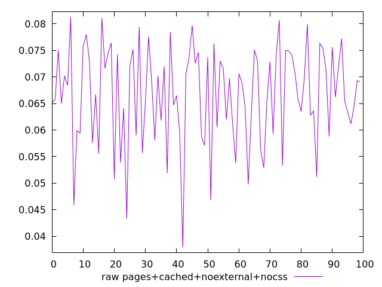
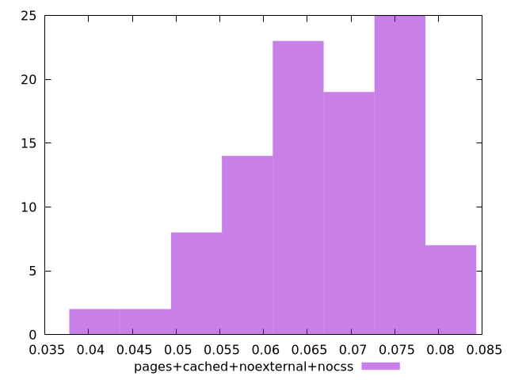

# Report pages+cached+noexternal+nocss

[parent..](./..)  


## Scores

  

## Score Histogram

  

## Score Indicators

```yaml
{}

```

## Raw Values

  

## Raw Values Histogram

  

## Raw Indicators

```yaml
min: 0.037899999999999996
max: 0.08129999999999998
range: 0.04339999999999999
mean: 0.06659999999999996
median: 0.0687
stdev: 0.009206856140941924
skewness: -0.6703837882708066

```

<style>
  img {
    max-width: 80%;
  }
</style>
      
