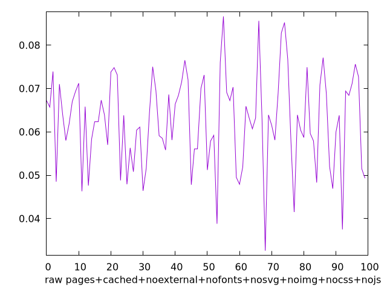
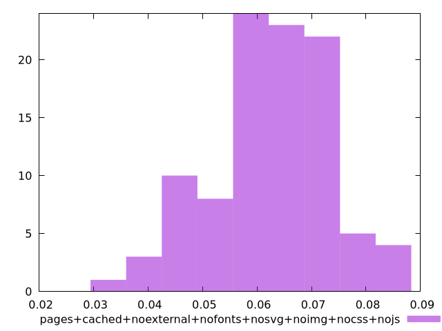

# Report pages+cached+noexternal+nofonts+nosvg+noimg+nocss+nojs

[parent..](./..)  


## Scores

  

## Score Histogram

  

## Score Indicators

```yaml
{}

```

## Raw Values

  

## Raw Values Histogram

  

## Raw Indicators

```yaml
min: 0.032600000000000004
max: 0.0866
range: 0.05399999999999999
mean: 0.06238499999999998
median: 0.06319999999999999
stdev: 0.010671320208858885
skewness: -0.23775382216862348

```

<style>
  img {
    max-width: 80%;
  }
</style>
      
