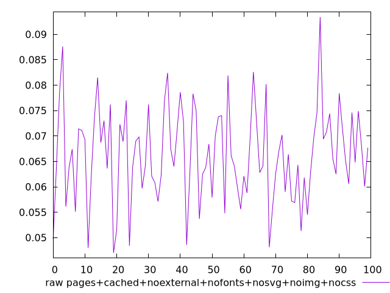
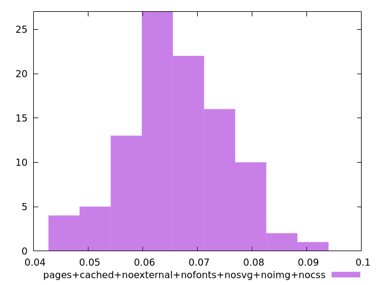

# Report pages+cached+noexternal+nofonts+nosvg+noimg+nocss

[parent..](./..)  


## Scores

  

## Score Histogram

  

## Score Indicators

```yaml
{}

```

## Raw Values

  

## Raw Values Histogram

  

## Raw Indicators

```yaml
min: 0.04699999999999999
max: 0.0934
range: 0.046400000000000004
mean: 0.066317
median: 0.0658
stdev: 0.009187622706663567
skewness: 0.1010468884895514

```

<style>
  img {
    max-width: 80%;
  }
</style>
      
