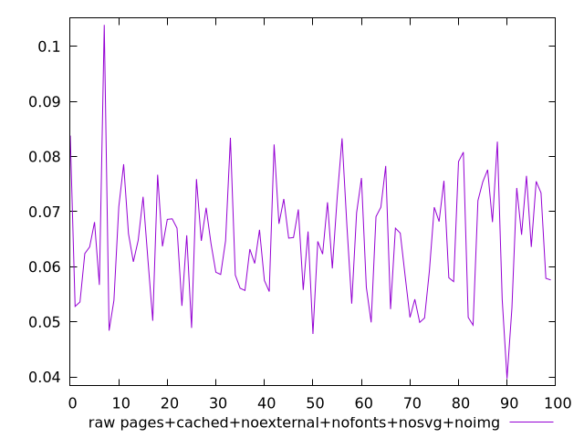
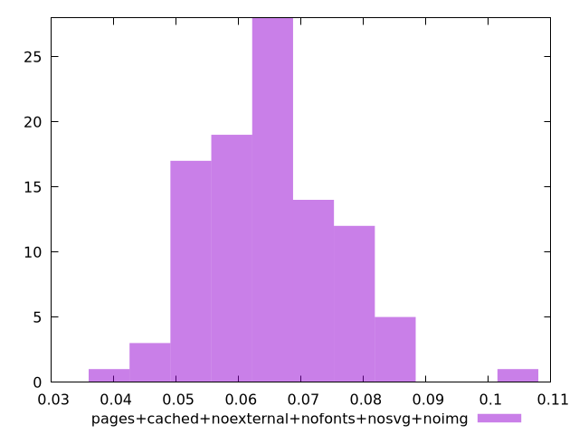

# Report pages+cached+noexternal+nofonts+nosvg+noimg

[parent..](./..)  


## Scores

  

## Score Histogram

  

## Score Indicators

```yaml
{}

```

## Raw Values

  

## Raw Values Histogram

  

## Raw Indicators

```yaml
min: 0.0397
max: 0.10389999999999999
range: 0.0642
mean: 0.064633
median: 0.06475
stdev: 0.010463498984565342
skewness: 0.4614666465212942

```

<style>
  img {
    max-width: 80%;
  }
</style>
      
