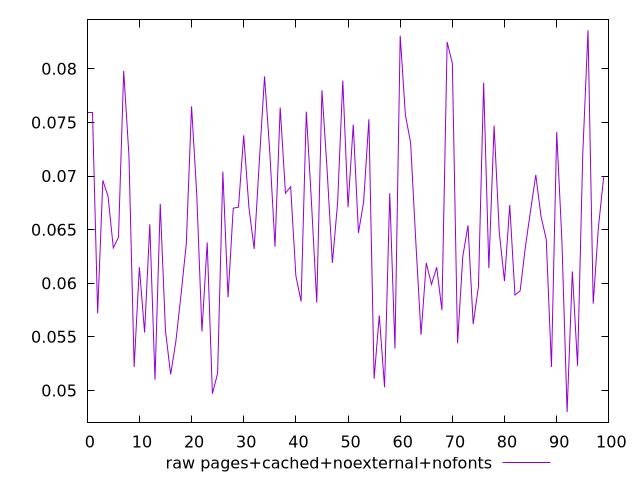
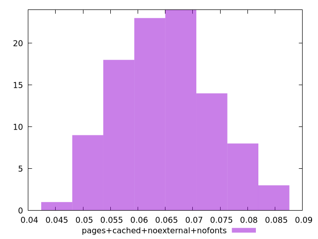

# Report pages+cached+noexternal+nofonts

[parent..](./..)  


## Scores

  

## Score Histogram

  

## Score Indicators

```yaml
{}

```

## Raw Values

  

## Raw Values Histogram

  

## Raw Indicators

```yaml
min: 0.048
max: 0.0836
range: 0.03559999999999999
mean: 0.06513099999999998
median: 0.0647
stdev: 0.008547463892874889
skewness: 0.11975992129169319

```

<style>
  img {
    max-width: 80%;
  }
</style>
      
