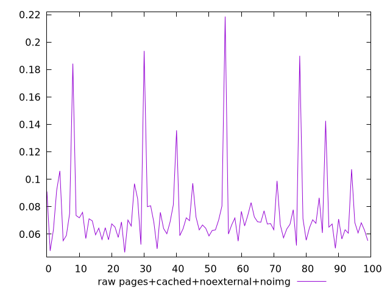
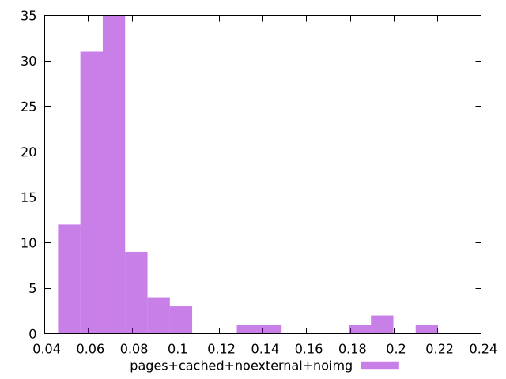

# Report pages+cached+noexternal+noimg

[parent..](./..)  


## Scores

  

## Score Histogram

  

## Score Indicators

```yaml
{}

```

## Raw Values

  

## Raw Values Histogram

  

## Raw Indicators

```yaml
min: 0.0467
max: 0.2186
range: 0.1719
mean: 0.07499
median: 0.0676
stdev: 0.029219984599585257
skewness: 3.1553969775831003

```

<style>
  img {
    max-width: 80%;
  }
</style>
      
