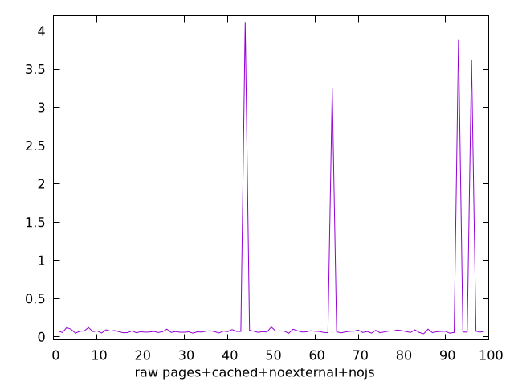
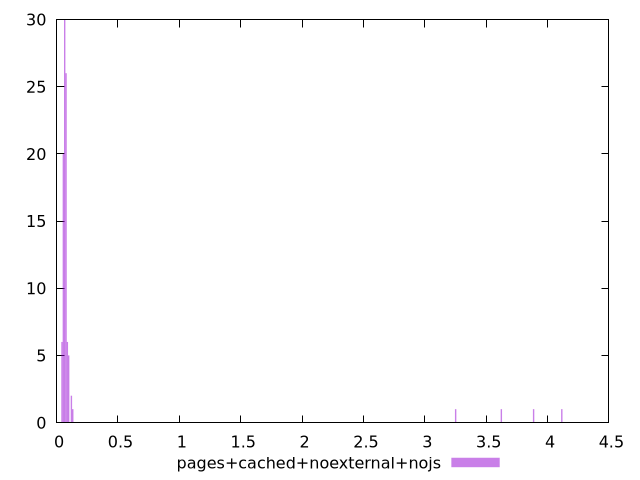

# Report pages+cached+noexternal+nojs

[parent..](./..)  


## Scores

  

## Score Histogram

  

## Score Indicators

```yaml
{}

```

## Raw Values

  

## Raw Values Histogram

  

## Raw Indicators

```yaml
min: 0.0398
max: 4.119
range: 4.0792
mean: 0.215662
median: 0.06889999999999999
stdev: 0.7184124734134283
skewness: 4.751086435570273

```

<style>
  img {
    max-width: 80%;
  }
</style>
      
