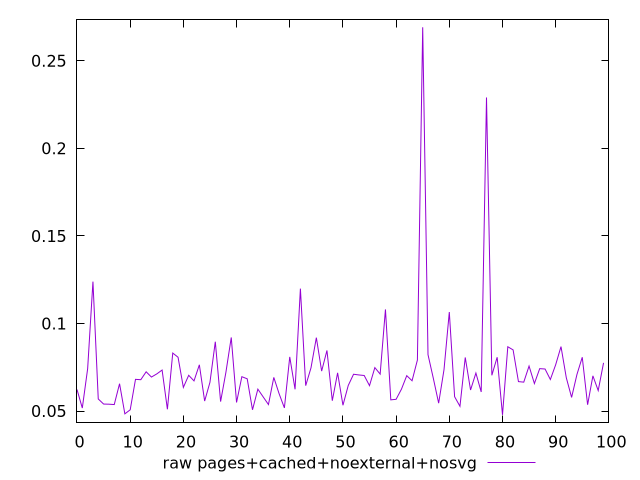
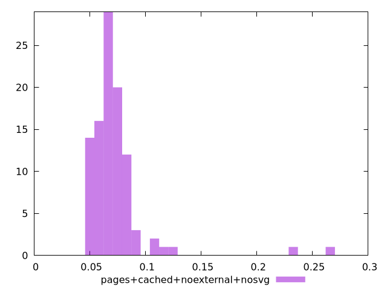

# Report pages+cached+noexternal+nosvg

[parent..](./..)  


## Scores

  

## Score Histogram

  

## Score Indicators

```yaml
{}

```

## Raw Values

  

## Raw Values Histogram

  

## Raw Indicators

```yaml
min: 0.047799999999999995
max: 0.26909999999999995
range: 0.22129999999999994
mean: 0.07295299999999999
median: 0.0691
stdev: 0.028865836052330084
skewness: 4.778533227832652

```

<style>
  img {
    max-width: 80%;
  }
</style>
      
