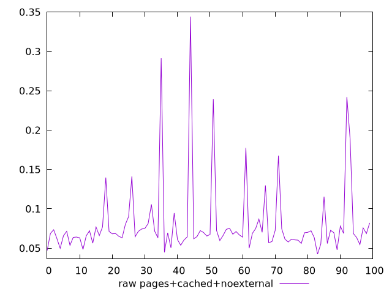
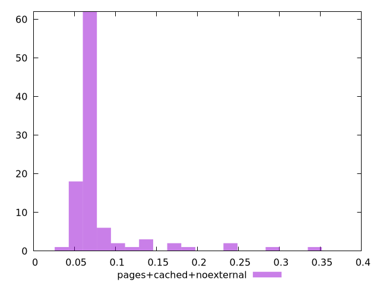

# Report pages+cached+noexternal

[parent..](./..)  


## Scores

  

## Score Histogram

  

## Score Indicators

```yaml
{}

```

## Raw Values

  

## Raw Values Histogram

  

## Raw Indicators

```yaml
min: 0.0424
max: 0.3442
range: 0.3018
mean: 0.08100800000000001
median: 0.06860000000000001
stdev: 0.04814392937847928
skewness: 3.4424258438036333

```

<style>
  img {
    max-width: 80%;
  }
</style>
      
