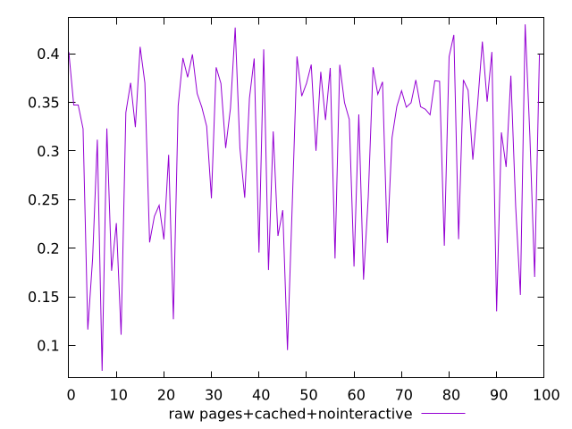
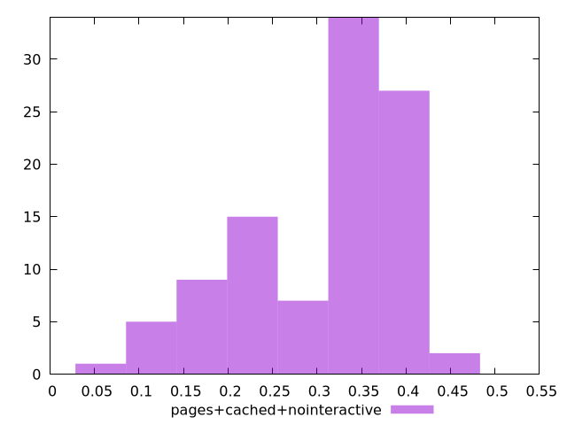

# Report pages+cached+nointeractive

[parent..](./..)  


## Scores

  

## Score Histogram

  

## Score Indicators

```yaml
{}

```

## Raw Values

  

## Raw Values Histogram

  

## Raw Indicators

```yaml
min: 0.0739
max: 0.43019999999999997
range: 0.35629999999999995
mean: 0.3077472132108375
median: 0.34119999999999995
stdev: 0.08673932092308494
skewness: -0.8528552987141973

```

<style>
  img {
    max-width: 80%;
  }
</style>
      
