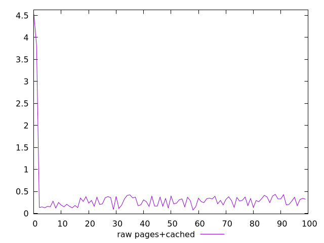
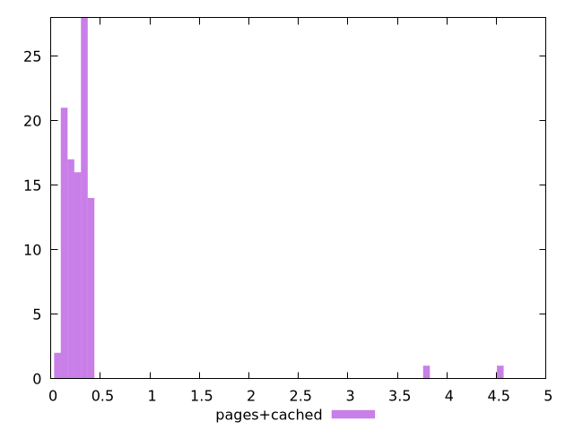

# Report pages+cached

[parent..](./..)  


## Scores

  

## Score Histogram

  

## Score Indicators

```yaml
{}

```

## Raw Values

  

## Raw Values Histogram

  

## Raw Indicators

```yaml
min: 0.076
max: 4.537
range: 4.461
mean: 0.34504843922468437
median: 0.2864
stdev: 0.5584260378090267
skewness: 6.636786471622823

```

<style>
  img {
    max-width: 80%;
  }
</style>
      
