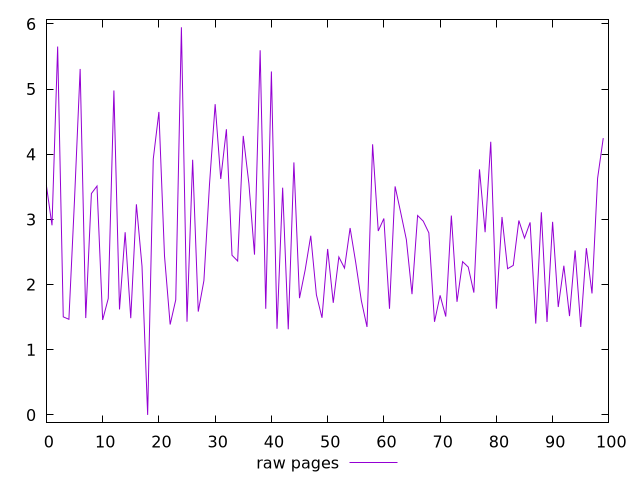
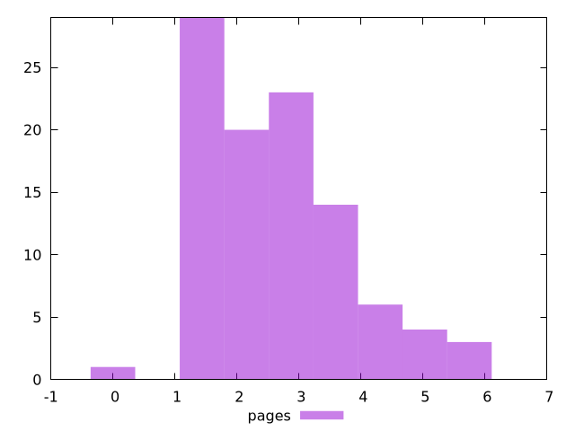

# Report pages

[parent..](./..)  


## Scores

  

## Score Histogram

  

## Score Indicators

```yaml
{}

```

## Raw Values

  

## Raw Values Histogram

  

## Raw Indicators

```yaml
min: 0
max: 5.949
range: 5.949
mean: 2.6888000000000005
median: 2.4915000000000003
stdev: 1.1533495133739817
skewness: 0.7276610472200687

```

<style>
  img {
    max-width: 80%;
  }
</style>
      
