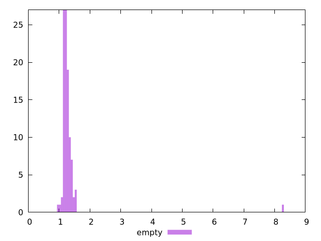

# Report empty

[parent..](./..)  


## Scores

  

## Score Histogram

  

## Score Indicators

```yaml
{}

```

## Raw Values

  

## Raw Values Histogram

  

## Raw Indicators

```yaml
min: 0.9531
max: 8.298999999999992
range: 7.345899999999992
mean: 1.3154029999999997
median: 1.223725
stdev: 0.7096970157687003
skewness: 9.523203023621338

```

<style>
  img {
    max-width: 80%;
  }
</style>
      
