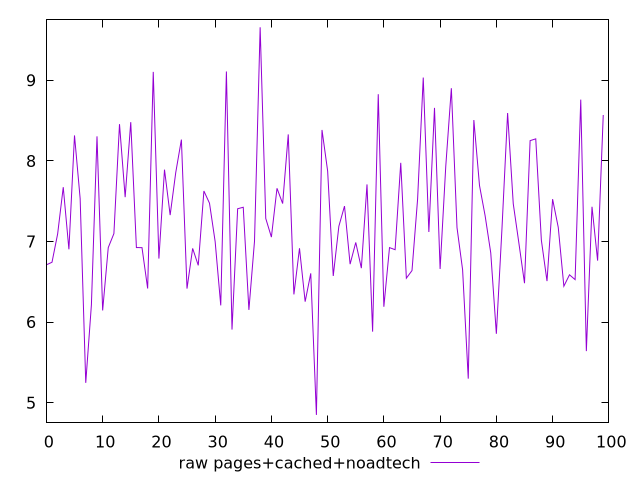
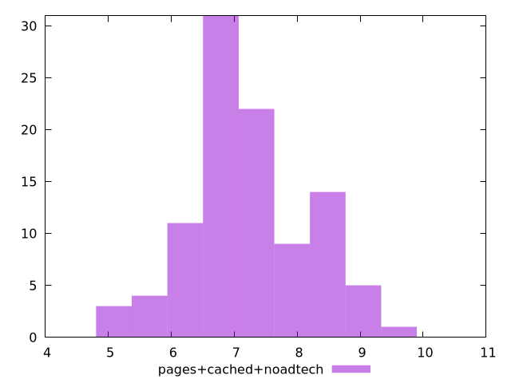

# Report pages+cached+noadtech

[parent..](./..)  


## Scores

  

## Score Histogram

  

## Score Indicators

```yaml
{}

```

## Raw Values

  

## Raw Values Histogram

  

## Raw Indicators

```yaml
min: 4.847800000000001
max: 9.6587
range: 4.810899999999998
mean: 7.234225130688635
median: 7.09635
stdev: 0.9178763762310446
skewness: 0.21035942169418756

```

<style>
  img {
    max-width: 80%;
  }
</style>
      
