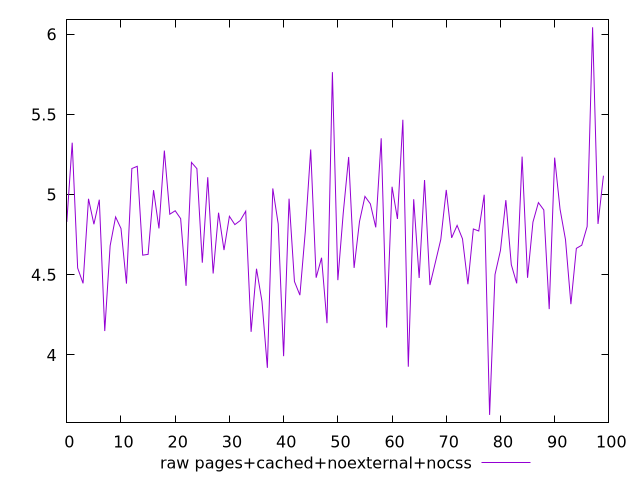
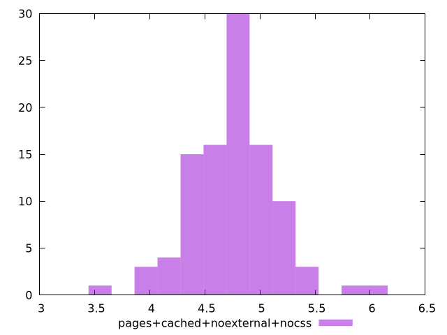

# Report pages+cached+noexternal+nocss

[parent..](./..)  


## Scores

  

## Score Histogram

  

## Score Indicators

```yaml
{}

```

## Raw Values

  

## Raw Values Histogram

  

## Raw Indicators

```yaml
min: 3.6261
max: 6.043500000000001
range: 2.4174000000000007
mean: 4.765624999999999
median: 4.804499999999999
stdev: 0.37342901423831537
skewness: 0.031018945153455938

```

<style>
  img {
    max-width: 80%;
  }
</style>
      
