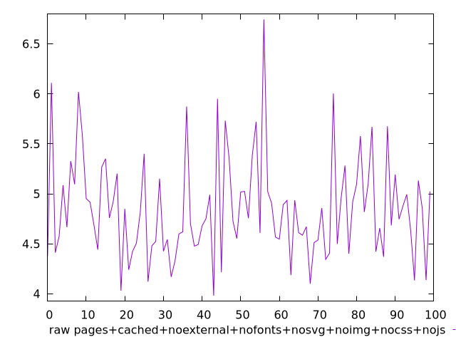
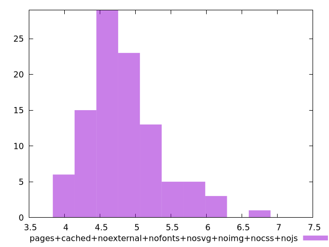

# Report pages+cached+noexternal+nofonts+nosvg+noimg+nocss+nojs

[parent..](./..)  


## Scores

  

## Score Histogram

  

## Score Indicators

```yaml
{}

```

## Raw Values

  

## Raw Values Histogram

  

## Raw Indicators

```yaml
min: 3.9815
max: 6.7449
range: 2.7634000000000003
mean: 4.851896
median: 4.7531
stdev: 0.5114648294692411
skewness: 0.9742543640610797

```

<style>
  img {
    max-width: 80%;
  }
</style>
      
