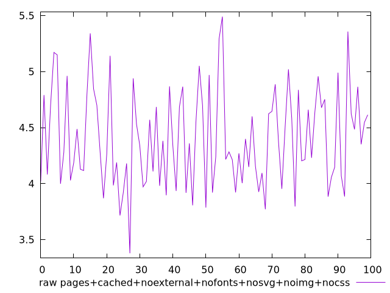
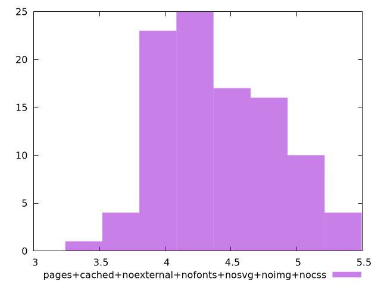

# Report pages+cached+noexternal+nofonts+nosvg+noimg+nocss

[parent..](./..)  


## Scores

  

## Score Histogram

  

## Score Indicators

```yaml
{}

```

## Raw Values

  

## Raw Values Histogram

  

## Raw Indicators

```yaml
min: 3.3782
max: 5.490600000000001
range: 2.1124000000000005
mean: 4.403251000000001
median: 4.341099999999999
stdev: 0.4337992435436004
skewness: 0.34482772817367446

```

<style>
  img {
    max-width: 80%;
  }
</style>
      
