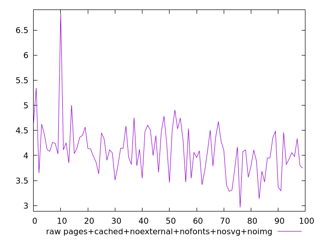
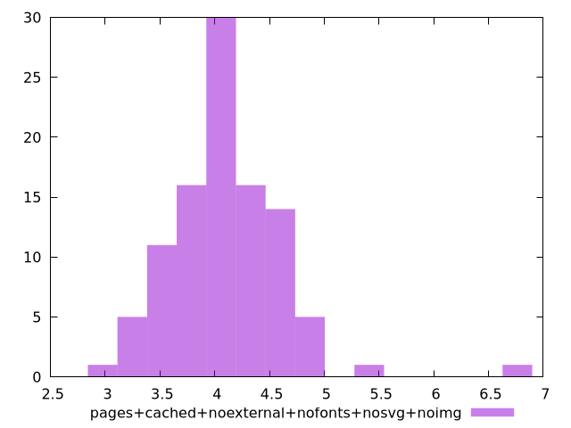

# Report pages+cached+noexternal+nofonts+nosvg+noimg

[parent..](./..)  


## Scores

  

## Score Histogram

  

## Score Indicators

```yaml
{}

```

## Raw Values

  

## Raw Values Histogram

  

## Raw Indicators

```yaml
min: 2.9648000000000003
max: 6.8281
range: 3.8632999999999997
mean: 4.102145000000002
median: 4.09845
stdev: 0.5095823561260732
skewness: 1.4131628627736286

```

<style>
  img {
    max-width: 80%;
  }
</style>
      
