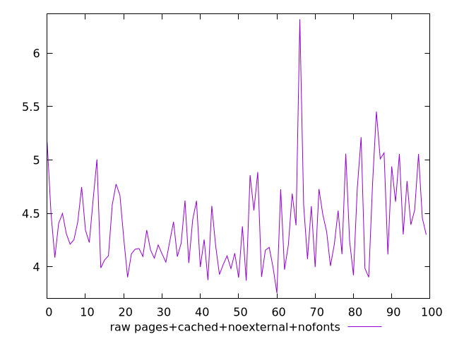
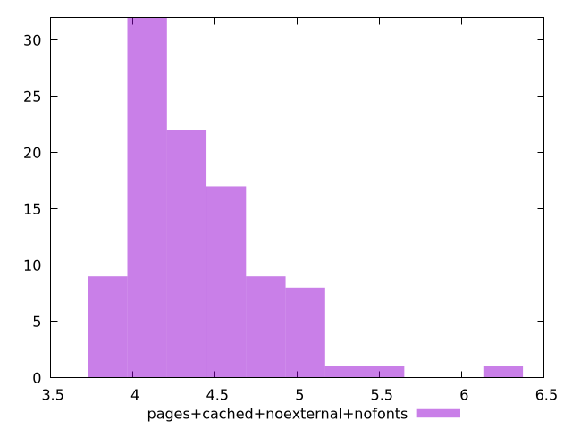

# Report pages+cached+noexternal+nofonts

[parent..](./..)  


## Scores

  

## Score Histogram

  

## Score Indicators

```yaml
{}

```

## Raw Values

  

## Raw Values Histogram

  

## Raw Indicators

```yaml
min: 3.7548999999999997
max: 6.3172
range: 2.5623
mean: 4.3869380000000024
median: 4.28435
stdev: 0.4082610164539347
skewness: 1.441517197947911

```

<style>
  img {
    max-width: 80%;
  }
</style>
      
