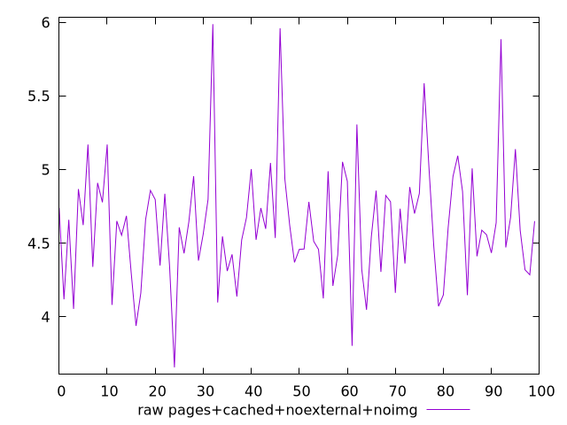
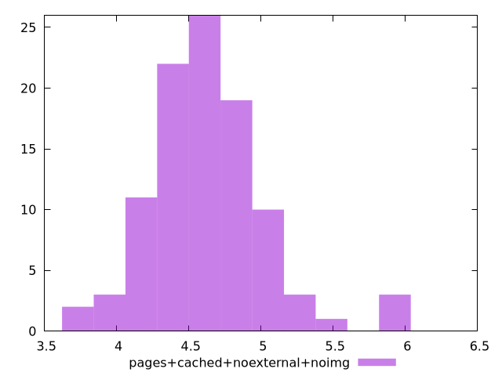

# Report pages+cached+noexternal+noimg

[parent..](./..)  


## Scores

  

## Score Histogram

  

## Score Indicators

```yaml
{}

```

## Raw Values

  

## Raw Values Histogram

  

## Raw Indicators

```yaml
min: 3.657000000000001
max: 5.987299999999999
range: 2.3302999999999985
mean: 4.621577999999999
median: 4.6014
stdev: 0.40700650279326
skewness: 0.8309158340719475

```

<style>
  img {
    max-width: 80%;
  }
</style>
      
