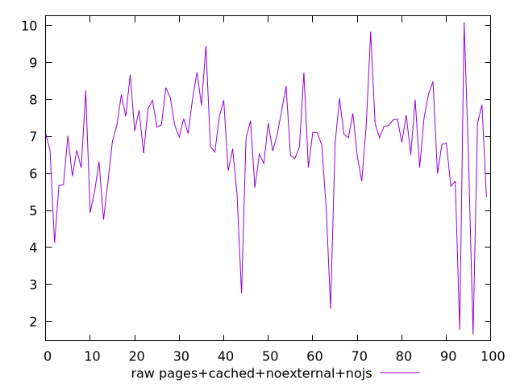
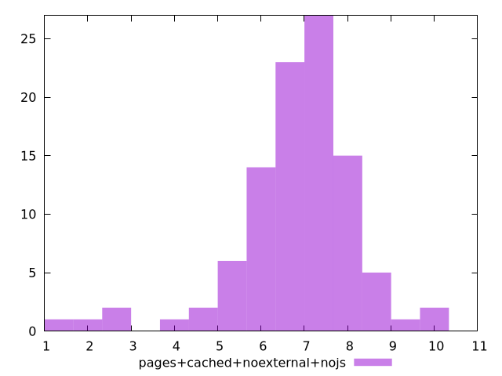

# Report pages+cached+noexternal+nojs

[parent..](./..)  


## Scores

  

## Score Histogram

  

## Score Indicators

```yaml
{}

```

## Raw Values

  

## Raw Values Histogram

  

## Raw Indicators

```yaml
min: 1.6469999999999998
max: 10.0978
range: 8.4508
mean: 6.829911999999999
median: 7.0032499999999995
stdev: 1.4042347898610117
skewness: -1.2678517706901036

```

<style>
  img {
    max-width: 80%;
  }
</style>
      
